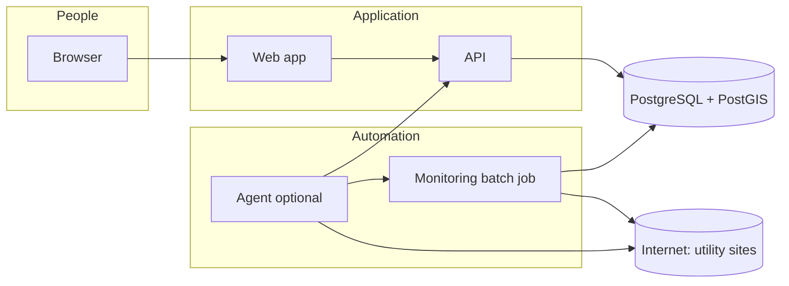

# Architecture (system overview)

This document matches how the **Utility Tariff Finder** is structured: storage, web/API, and monitoring. Written for **system-level** readers (not only software developers).

## Parts of the system

| Piece | Role |
|--------|------|
| **Web app** | What people see in the browser. |
| **API** | The program that answers requests and talks to the database. |
| **Database (PostgreSQL + PostGIS)** | Stores utilities, map areas, tariffs, monitoring URLs, and check history. |
| **Monitoring job** | A batch process that fetches many tariff URLs/PDFs, fingerprints content, and records changes/errors. |
| **Agent (e.g. OpenClaw)** *(planned operator)* | Reads monitoring results, researches broken links, **updates URL rows in the database**, then triggers **targeted re-checks**. It should **not** rewrite application source code. |

## Storage (“drawers” in the database)

- **Utilities** — who sells power, name, region.
- **Service territories** — map-based or rule-based matching (US polygons, postal hints, etc.).
- **Tariffs** — rate schedules (residential vs commercial, components, etc.).
- **Monitoring sources** — URLs/PDFs to watch for changes.
- **Monitoring logs** — each check: success, error message, content fingerprint (hash), whether content changed.

## Diagram: main components

## Flow: address lookup

1. User enters an address.  
2. API **geocodes** it (coordinates + country).  
3. API **matches utilities** (polygons, ZIP/postal, state/province fallbacks).  
4. API loads **tariffs** for those utilities.  
5. Web app displays utilities and rates (including residential vs commercial).

## Flow: monitoring + agent remediation (intended)

1. Monitor job runs on a schedule (or on demand): **many URLs in parallel**, writes hashes/logs.  
2. Job can emit a **JSON summary** (especially a list of errors) for tools/agents.  
3. Agent (or human) **updates `monitoring_sources.url`** when a link moves.  
4. **Targeted re-check** runs for those IDs only (`wait=true` on the check-ids API).  
5. Success = **no error** and a **non-empty content hash** (and optionally extra checks later).

## Related docs

- [GCP deployment](GCP.md) — Google Cloud VM, auth, and what **not** to paste into chat.
