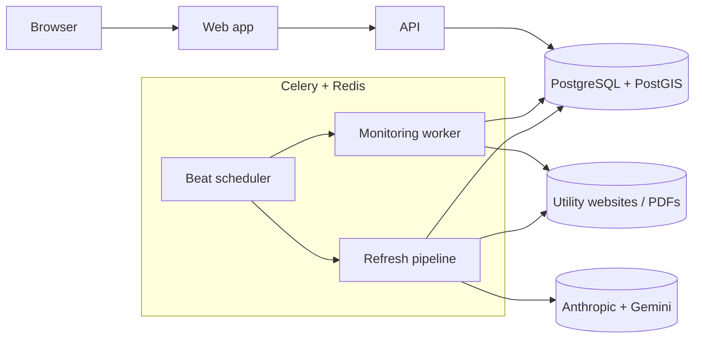

# Architecture (system overview)

How the **Utility Tariff Finder** is structured. For the full operating manual
(runbook, guardrails, env vars), see [`AGENTS.md`](../AGENTS.md).

_Last updated: 2026-08-28._

## Parts of the system

| Piece | Role |
|-------|------|
| **Web app** (React/Vite) | Address lookup, utility/tariff browsing, and admin monitoring/data-quality dashboards. |
| **API** (FastAPI) | Answers lookups, serves tariff data, and exposes admin/monitoring endpoints. |
| **Database** (PostgreSQL + PostGIS) | Utilities, service-territory polygons, tariffs + rate components, monitoring sources/logs, refresh runs, and page fingerprints. |
| **Monitoring worker** (Celery) | Fetches tariff URLs/PDFs on a schedule, fingerprints content, records changes/errors. |
| **Refresh pipeline** (Celery + `tariff_pipeline.py`) | The extraction engine: discovers rate pages and extracts/validates structured tariffs with LLMs. |
| **Scheduler** (Celery beat) | Weekly monitoring, monthly refresh, quarterly recovery, hourly stalled-run reaper. |

## Storage (main tables)

- **utilities** — who sells power, region, active flag, and refresh-quarantine bookkeeping.
- **service_territories** — PostGIS polygons + zip arrays for address→utility matching.
- **tariffs** + **rate_components** — rate schedules and their priced parts. Retired tariffs are **soft-superseded** (`superseded_by_tariff_id`), never deleted.
- **monitoring_sources** / **monitoring_logs** — URLs watched for change + per-check history.
- **refresh_runs** — one row per refresh run (targets, results, per-run LLM cost).
- **rate_page_fingerprints** — content hashes so unchanged pages can be skipped.

## Main components

```mermaid
flowchart LR
  U[Browser] --> FE[Web app] --> API[API] --> DB[(PostgreSQL + PostGIS)]
  subgraph automation [Celery + Redis]
    MON[Monitoring worker]
    REF[Refresh pipeline]
    BEAT[Beat scheduler]
  end
  BEAT --> MON
  BEAT --> REF
  MON --> DB
  REF --> DB
  REF --> LLM[(Anthropic + Gemini)]
  MON --> NET[(Utility websites / PDFs)]
  REF --> NET
```

## Flow: address lookup
1. User enters an address.
2. API **geocodes** it (Census → Nominatim → Google fallback).
3. API **matches utilities** (PostGIS polygon containment, then zip/state fallbacks).
4. API loads **live** tariffs for those utilities (superseded rows excluded).
5. Web app shows utilities and rate components (residential + commercial).

## Flow: extraction pipeline (per utility)
`run_pipeline()` runs up to six phases: **1** find rate page (Brave/CSE) → **2**
crawl for tariff pages/PDFs → **3** LLM extraction with 3-tier model routing
(Gemini Flash → Haiku → Opus) → **4** validate (percentile bounds, unit
normalization) + store + soft-supersede matching seeds → **5** AI-guided
navigation fallback → **6** Gemini Deep Research for the long tail. See
[`AGENTS.md` §4](../AGENTS.md).

## Flow: scheduled refresh
1. **Weekly** monitoring fingerprints all sources and flags changes/errors.
2. **Monthly** refresh re-extracts changed + oldest-stale utilities (capped, oldest-first), skipping quarantined ones.
3. **Quarterly** recovery retries utilities whose sources are all erroring.
4. Utilities that repeatedly yield nothing are **soft-quarantined** and re-checked infrequently.
5. Each run records targets, results, and per-phase LLM cost in `refresh_runs`.

## Related docs
- [`AGENTS.md`](../AGENTS.md) — operating manual, runbook, guardrails.
- [GCP deployment](GCP.md) · [Database access](DATABASE_ACCESS.md) · [Centralized regulators](CENTRALIZED_REGULATORS.md)
